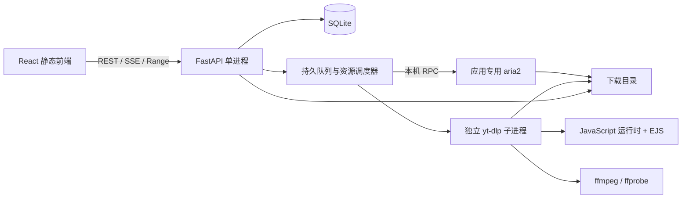

# Grabbit 产品与技术设计

## 1. 定位与范围

Grabbit 是运行在个人 VPS 上的离线下载工具。用户关闭浏览器后，服务器继续执行队列；再次登录后可以查看进度、历史和下载文件，并播放浏览器支持的媒体。

本文的产品行为来自已确认的需求；具体表结构、接口、限额和实现策略是为落地补充的技术决策。所有性能数值均为待验证的设计目标，不是已测结果。

| 项目 | 首版决策 |
| --- | --- |
| 运行环境 | Debian 13，amd64/x86_64，768 MB RAM，不使用 Docker |
| 用户 | 单管理员、必须登录；服务器命令创建和重置账号，无公开注册 |
| 普通下载 | HTTP/HTTPS URL、磁力链接、上传 .torrent；专用 aria2 进程由应用管理 |
| 视频下载 | yt-dlp + ffmpeg，重点验收 YouTube 和 B站；先解析、再选择、再入队 |
| 并发 | 普通和视频共用全局队列，默认 1；视频合并也占名额 |
| 视频默认 | 最高 1080p；优先兼容格式，不自动转码；支持仅下载音频 |
| 字幕 | 默认中英文；同语言优先人工字幕，缺失时用自动字幕；独立文件 |
| 批量 | 多链接、YouTube 播放列表、B站多 P；逐项选择、独立任务、全局排序 |
| BT | 先获取文件列表并选文件；完成后立即停止做种 |
| 限速 | 提供下载/上传限速，默认不限；上传限速用于 aria2/BT |
| Cookie | 独立页面，多配置、站点默认值，创建视频任务时选择或明确不使用 |
| 文件 | 独立文件管理、历史、浏览器下载、媒体播放；默认永久保留 |
| 界面 | 实用工具后台、中英文、浅色默认、可切深色、手机偶尔使用 |
| 部署 | 前端在开发机/CI 构建，静态资源放到后端；VPS 只运行后端和下载工具 |

首版不包含：多用户、远程 aria2、Docker、定时下载、通知、扫码登录、自动提取浏览器 Cookie、浏览器插件、自动清理媒体、媒体库海报墙、跨设备播放位置同步、转 MP3/视频转码、直播录制、DRM 解密、付费权限绕过。未重点验收的网站可交给 yt-dlp 尝试，界面明确标注兼容性未验证。

## 2. 页面和交互

### 2.1 公共布局

- 桌面端左侧固定导航约 220px，右侧主区域；导航顺序：普通下载、视频下载、下载历史、文件管理、Cookie 管理、设置。
- 顶栏展示下载/上传总速度、剩余磁盘空间、运行任务数；右侧语言、主题、管理员菜单。速度指下载引擎流量，不包含浏览器播放/取文件流量。
- 普通和视频页面各有“新建下载”，打开对应页签；弹窗仍允许切换普通/视频。
- 页面提供“全局队列”抽屉，展示两类等待任务；上移、下移、置顶按全局顺序生效。调整排序不抢占运行任务。
- 列表默认每页 30 条，上限 100；搜索、状态过滤、批量操作。视频列表用小封面，不使用大图卡片墙。
- 小于 768px 时导航折叠为抽屉，任务行改为紧凑卡片；核心操作可点按，复杂列隐藏在详情内。按钮有效触控区域至少 44px。
- 默认浅色；浅色使用浅灰页面、白色面板、蓝色主操作；深色使用深灰面板。状态同时使用文字和图标，不仅依赖颜色。
- 全部按钮有可访问名称；弹窗处理焦点和 Esc；错误文字对应输入项；键盘能完成新建和取消操作。

### 2.2 语言与主题

提供 `zh-CN`、`en` 两套完整资源。首次按浏览器语言，任何中文语言匹配中文，否则英文。主题第一次固定浅色，不自动跟随系统。后续选择保存在浏览器 localStorage，登录页同样支持切换。

API 使用稳定英文枚举/错误码，前端翻译，不把数据库状态保存为中文。标题、文件名保留原文；第三方错误保留脱敏原文并附本地化解释。时间数据库存 UTC，界面按浏览器时区显示；速率用 KiB/s、MiB/s，大小用二进制单位。

### 2.3 普通下载

状态过滤：全部未完成、等待、获取元数据、待选文件、下载中、暂停、失败。任务行含名称、类型、进度、已下载/总量、速度、预计剩余、状态、操作。

新建流程：

1. 粘贴一行或多行 HTTP/HTTPS/磁力链接，或上传种子；上传种子一次一个，链接每批最多 100 条。
2. 选择下载根目录下的子目录，默认 `general`；目录选择器只提供受控相对路径。
3. 校验、重复检测，逐条报告问题；有重复时默认不提交，用户明确“仍然添加”才创建重复任务。
4. URL 入队；种子先展示文件列表；磁力先创建元数据任务，排到后可获取文件列表。
5. BT 文件默认全选；确认选择后才排入内容下载队列。显示已选大小。文件过滤/全选/反选适用于目录树，不能提交空选择。

支持暂停、继续、取消、重试；取消保留临时文件，删除文件另行确认。暂停/取消按钮立即变为处理中，收到引擎确认后才释放名额。取消不是删除历史。

BT 未选文件可能因共享分片产生少量边界数据；不能承诺磁盘上绝无未选文件内容，文件 UI 仅把实际选中的完整产物列为完成文件。

### 2.4 视频下载

新建分为三步，支持返回修改：

1. 输入网址、选择 Cookie（含“不使用”）、点击解析。多网址可批量解析；解析有等待状态和取消按钮。
2. 展示标题、时长、封面和可选项。单视频可选实际可用清晰度、视频/仅音频、字幕；合集先显示轻量条目列表供勾选，再为选中项使用统一画质策略，执行时按单项实际格式解析。不能把首个条目的格式列表套到整个合集。
3. 选择子目录（默认 `videos` 或 `audio`），显示任务数量和默认策略，确认入队。

默认画质是“不超过 1080p 的最佳兼容格式”，可选择 720p、1080p、其他已解析画质或最高。优先 H.264 + AAC / MP4，缺失时采用可用格式，不转码。若用户选择某一清晰度上限，允许向下降级；若明确选择格式 ID，失效时重新解析并失败提示，不偷偷改变用户选择。

仅音频默认选源站最佳音频并保留原格式，例如 m4a/webm；不转换 MP3。字幕选项默认中英文并可关闭或修改；人工/自动按具体语言匹配，保留简繁中文或多个可用英文变体，但排除直播聊天等非字幕轨道。没有目标字幕仍成功；有字幕但下载/转换失败则显示完成警告，提供针对字幕的重试入口，不重下载已完成视频。

任务行含封面、标题、站点、当前阶段、进度、速率、剩余时间及操作。阶段包括解析、下载视频、下载音频、下载字幕、合并、整理文件；无法得到可靠百分比时显示阶段和不定进度，不伪造数字。多流下载可以展示当前流进度，不能把单个流 100% 当任务完成。

视频提供停止、重试，不承诺真正暂停恢复；停止保留临时产物。重试优先利用同任务目录的部分文件，但地址变化、格式变化或源站不支持续传时可能重新下载。

### 2.5 详情、历史和文件

点击任务打开详情侧栏：基本信息、Cookie 配置名称（无内容）、策略、文件、阶段、错误与最近日志。来源网址显示时隐藏敏感查询参数，不提供无鉴权分享链接。

历史包含成功、带警告成功、失败、取消的终态记录；两个下载页面也可以查看失败任务。支持类型/站点/时间/结果筛选，按完成时间倒序。成功项可播放、打开文件位置、重新下载；重新下载创建新 ID，重试失败任务复用原 ID。

文件页面是下载根目录的受控目录浏览器，不是服务器文件管理器。展示目录、名称、大小、修改时间、来源任务和操作；支持分页、面包屑、按名称搜索当前目录，不递归全盘实时扫描。已脱离历史记录的文件仍可浏览。首版不做重命名或移动。

删除记录默认仅删除记录，保留磁盘文件及文件索引；勾选“同时删除文件”需再次显示具体范围。下载目录删除也需列明数量；运行任务占用的目录禁止删除。删除磁盘文件不可从应用恢复，确认文案必须说明。缺失文件显示“已不存在”，历史不随之消失。

每个任务写独占目录 `<所选子目录>/<task_uuid>/`，目录内使用清理后的原名或视频标题，避免不同任务覆盖同名文件。界面显示友好标题，详情可见真实路径。BT 文件夹结构保留在任务目录内。`.part`、`.aria2` 和内部快照不作为可播放文件。

### 2.6 播放页

独立路由 `/player/:fileId`，提供原生 HTML5 video/audio、拖动、音量、倍速、全屏、字幕选择以及下载原文件。播放仅限完整文件，不做边下边播。

MP4 扩展名不保证编码可播放；后端读取媒体信息，前端进行能力探测并处理实际播放错误。无法播放时解释编码/容器不兼容，提供下载，不启用服务器转码。未知大小、未完成、缺失文件不显示播放按钮。

保存原字幕；另生成 UTF-8 WebVTT 供 `<track>` 使用，按语言和人工/自动标注。字幕格式转换可能丢失 ASS 特效，首版不保证样式还原。ffprobe/字幕处理排队执行，避免浏览页面就并发启动进程。

### 2.7 Cookie 页面

列表：名称、站点范围、默认标志、条目数量、更新时间、最近使用结果。新增/替换支持 Netscape cookies.txt 上传或粘贴，最大 1 MiB。支持命名、站点默认、删除；不提供完整内容查看或导出。

校验文件结构与域名，不把“导入成功”描述为“登录有效”。有效性只能由具体请求判断，最近失败可能是网络、风控或权限问题。YouTube/B站配置分别使用，不自动向其他站点套用。其他站点需要用户明确关联域名范围。

任务保存 Cookie 配置 ID，执行时复制当前版本到该次尝试的私有临时文件，权限 0600，退出后清除；替换配置只影响后续执行，不修改运行中的快照。被等待/运行任务引用的配置不允许删除，先更换任务配置或停止任务；终态引用可置空并保留名称快照。

任务重试对话框可修改 Cookie 后重试。Cookie 内容不进入 SQLite、日志、错误响应或 SSE。

### 2.8 设置页面

分区：下载（全局并发、限速、磁盘阈值）、依赖服务（版本/检测/安装/yt-dlp 更新）、账号（密码）、系统信息（路径、内存、版本）。下载根目录由部署配置指定，只读显示，避免运行期间迁移文件。

依赖状态分为未安装、不可执行、检测失败、可用；YouTube 另展示 JS/EJS 能力。安装按钮启动后台作业，显示排队、日志、结果，不阻塞 HTTP。失败显示可操作原因；没有配置安装权限时展示部署修复步骤，而不是假装安装成功。

## 3. 架构与选型



后端使用 FastAPI、Pydantic、SQLAlchemy 2 + aiosqlite、Alembic、httpx、Uvicorn；一个 worker。使用 asyncio 生命周期任务实现调度、监控和事件广播，不引入 Redis/Celery。FastAPI 请求内只验证并持久化作业，不能用请求生命周期的 BackgroundTasks 承担可靠下载。

前端沿用现有 React、TypeScript、React Router、Vite、Tailwind 骨架，切换 SPA；采用 TanStack Query 管理服务端缓存、i18next 管理语言，局部状态用 React。以简单表格/对话框组件为主，不引入大型图表包。

当前仓库只是骨架：`backend/main.py` 尚未创建 FastAPI app；`frontend/react-router.config.ts` 当前开启 SSR。实现时设 `ssr: false`，构建静态产物复制进 `backend/app/static/`。React Router 的 SPA 构建仍可能执行构建阶段渲染，浏览器 API 应在 effect 或安全检查后使用。依据：[React Router SPA 文档](https://reactrouter.com/how-to/spa)。

当前后端要求 Python >=3.14；目标调整为 Python >=3.13，优先使用 Debian 13 系统 Python 的 venv，不要求低内存 VPS 编译 Python。Debian 13 的 Python 版本依据：[Debian Python 文档](https://wiki.debian.org/Python)。具体依赖版本在实现时生成锁文件，不能直接假定现有模板全部兼容。

建议目录：

```text
backend/
  app/
    main.py                 # lifespan、API、静态资源挂载
    api/                    # auth/tasks/files/cookies/settings/events/system
    core/                   # 配置、会话、路径规则、错误码
    db/                     # 表、事务、repository
    services/               # scheduler、recovery、file_index、event_bus
    engines/                # aria2 RPC、yt-dlp runner、媒体探测
    static/                 # 前端构建结果
  migrations/
  tests/
  pyproject.toml
frontend/app/
  routes/ components/ features/ locales/ lib/
deploy/                     # systemd、Nginx、受限安装 helper、配置示例
scripts/                    # 构建打包和安装入口
docs/
```

## 4. 调度与状态机

### 4.1 唯一调度权

SQLite 保存事实状态，后端调度器是唯一启动任务的组件。所有普通任务先暂停添加到 aria2，由调度器逐个解除暂停；禁止 aria2 自己把应用等待队列全部跑起来。运行视频、解析、元数据、后处理均有资源租约，异常必须释放。

全局 `max_active_tasks` 默认 1，设置范围 1–4；大于 1 显示低内存提示。调小上限不强制中断已有任务，等运行数下降后再启动。默认 FIFO，用户排序持久化；失败重试等待期间让出名额。

另设重型进程槽固定为 1：解析器、yt-dlp 执行及其 ffmpeg、独立媒体探测不能互相并发。预解析和磁力元数据也消耗全局名额；默认一个下载运行时新解析显示“等待资源”，允许用户先暂停/停止当前下载。这样不会为了弹窗解析突破内存约束。交互解析作业与下载任务在统一工作队列按入队时间竞争；不得长期抢占导致下载饥饿。

合并、最终文件检查、字幕转换属于任务执行过程，在完成前保留名额。单独字幕重试也是排队作业。用户未确认 BT 文件选择时释放名额，不阻塞后续下载。

### 4.2 任务状态

| 状态 | 含义 | 主要后续状态 |
| --- | --- | --- |
| queued | 等待资源/排队 | resolving、downloading、paused、stopped、cancelled |
| resolving | 获取磁力元数据或执行前视频解析 | awaiting_selection、downloading、retry_wait、failed |
| awaiting_selection | BT 等待用户选择文件 | queued、cancelled |
| downloading | 引擎执行下载 | postprocessing、completed、retry_wait、failed、paused、stopped、cancelled |
| postprocessing | 合并/字幕处理/产物检查 | completed、retry_wait、failed、stopped、cancelled |
| retry_wait | 已失败，等待自动重试时间 | queued、paused、stopped、cancelled |
| paused | 普通任务暂停 | queued、cancelled |
| stopped | 视频停止，保留临时文件 | queued、cancelled |
| completed | 主文件已校验并入索引，可能有 warning | 新建任务重新下载；可单独重试字幕 |
| failed | 自动尝试耗尽/不可自动恢复 | queued（手动重试）、cancelled |
| cancelled | 用户取消，保留文件 | 新建任务或显式重试 |

暂停/停止/取消请求使用 `pending_action` 记录意图，UI 展示“停止中”等；不能在子进程实际退出前认为停止完成。命令幂等。任务类型限制操作，不允许视频调用 pause。`blocked_reason` 是额外字段（disk_low、dependency_missing、maintenance、memory_low），不通过新增大量状态表达。

自动重试最多 2 次（总共最多 3 次尝试），分别等待 30 秒、120 秒；仅短暂网络错误、超时等可重试。Cookie/权限错误、格式不可用、无效输入、磁盘不足不自动循环。无法确定原因时最多按上限重试，不无限循环。手动重试开始新一轮尝试计数，保留旧尝试记录。

服务启动后先恢复数据库和引擎，再启动调度：此前 queued 保持；此前下载/后处理/任务解析中的任务重新校验产物、转 queued 续作；用户暂停/停止/取消保持；磁盘保护和维护阻断持久化。独立 analysis 作业此前 running 的转回 queued，超出有效期的标记 expired；正在安装的作业先检测实际工具版本并标记 interrupted，不自动重跑 apt。禁止仅凭数据库旧 PID 杀进程，必须核实进程身份；systemd 使用整个服务 cgroup 清理子进程，避免孤儿执行。

### 4.3 一致性与恢复

外部引擎启动和 SQLite 事务无法原子提交。每次执行先写 attempt（含稳定引擎标识/目标目录），提交后启动；aria2 使用预先生成的 GID，并在恢复时检查是否已存在。启动前失败可安全重试；启动后写库失败通过对账找回，不能重复启动。

用户动作和自然完成竞争时，以观察到的有效产物和引擎终态为依据；已经完成返回当前状态，不再删除结果。事件在事务提交后广播。文件删除采用持久化 operation 记录和逐文件结果，重启可对账，不能先标记删除成功后忽略磁盘失败。

## 5. 引擎适配

### 5.1 aria2

应用以服务用户启动专用 aria2c，RPC 仅监听 `127.0.0.1`，随机密钥保存在私有配置文件，不暴露给前端；启动后实际调用 getVersion 验证 RPC。应用关闭前保存会话并停止进程。

需要的 RPC 能力：添加 URL/种子、读取状态/文件、暂停/继续/移除、更改选中文件和限速、保存会话。磁力元数据 GID 与后续内容 GID 分开建映射；使用元数据后暂停的能力防止自动下载全部文件。配置零做种时间并实测完成后上传归零。参数与行为依据：[aria2 官方手册](https://aria2.github.io/manual/en/html/aria2c.html)。

低内存初始配置：每 HTTP 文件连接数/分片数 2，磁盘缓存 8 MiB，BT peers 上限 20；文件预分配关闭，统计轮询约 1 秒一次且批量读取。配置名称由实现时核对，不允许把界面字段原样传成任意引擎参数。为应用级重试设置有限引擎重试，避免两层相乘形成长时间失控。

元数据等待默认超时 180 秒，可手动重试；无 peers 与种子失败区分显示。种子上传限制 10 MiB，bencode 解析限制嵌套深度和文件数量（最多 20,000），检查路径；不要在 HTTP 请求中全量展开超大树到前端。

### 5.2 yt-dlp 与媒体工具

yt-dlp 安装在独立工具 venv，通过子进程调用，不在 FastAPI 进程内 import。解析输出只保留规范化摘要、候选格式和条目；下载用逐行结构化进度和完成标记，分离 stderr，限制缓冲区大小。禁止靠人类可读百分比正则作为唯一进度来源。工具支持进度模板、Cookie 文件和后处理机制，适配依据：[yt-dlp 官方 README](https://github.com/yt-dlp/yt-dlp/blob/master/README.md)。

统一使用参数数组和 `shell=False`；禁用用户/系统意外配置，禁止任意用户传入 CLI 参数。输出路径、网络重试、格式和字幕选项由服务端构造。每次进程独立进程组，先温和中断，10 秒后终止残留组；包括 ffmpeg 子进程。网络读超时默认 30 秒，单视频预解析默认 120 秒，总合集作业默认 10 分钟；下载不设置固定总时长上限。

合集使用分批、扁平条目解析，每页最多 100，单次加入最多 500 项；更大合集允许分批加载和提交。禁止一次 dump 整个超大合集为内存 JSON。未知时长和大小保持 null。排队后来源地址可能过期，所以存原始页面 URL、媒体 ID 和格式策略，执行时重新提取，不把临时直链当持久下载来源。

每个子进程网络分片并发固定 1。输出主文件完成后再运行 ffprobe 核实音视频流和时长，字幕转 WebVTT；ffmpeg 只合并/封装/字幕格式转换，不进行视频/音频重编码，不自动做完整文件的额外 faststart 重写。工具报告成功但没有有效主文件应失败。

为保证字幕错误不使主媒体失败，主媒体下载与字幕获取分成同一任务内的顺序步骤；后一步失败记录 warning，不能因 yt-dlp 一次混合命令的非零退出码误判整个主媒体失败。字幕单独重试沿用媒体 ID/来源页和 Cookie，复用已存在媒体文件。恢复合并时先检查完整输出，再检查输入流，不能仅按退出码判定是否要重下。

YouTube 完整支持还需要 EJS 和受支持的 JS 运行时，不能仅验证 yt-dlp --version。首版选 Deno，工具 venv 安装 yt-dlp 的 default 依赖组以带上匹配 EJS；Deno 来自官方发布制品，版本固定并验证校验值。运行时不临时联网下载 EJS 脚本。依据：[yt-dlp EJS 官方说明](https://github.com/yt-dlp/yt-dlp/wiki/EJS)。这不是额外前端服务，Deno 只在视频处理需要时启动。

本机工具健康检查和真实站点下载验收分开；本机检测通过不意味着 VPS IP、Cookie 或站点权限一定可用。遇到平台风控/额外令牌要求应如实报告，不承诺所有视频都能下载。

### 5.3 限速语义

下载设置是服务器下载任务的总体目标上限，0 不限；上传上限只影响 aria2，不包括 HTTP 播放服务。默认并发 1 时直接应用完整额度。

多任务时按运行的网络传输任务数均分下载额度：aria2 获得普通任务份额总和，单个视频获得一份。aria2 可动态更新；yt-dlp 运行中无法保证动态改变 CLI 限速，新启动视频的额度为固定快照；调度计算已占额度，为后续任务分配剩余额度，必要时继续等待。修改下载限速时对现有视频显示“下次执行生效”，可以停止重试应用；不能声称严格实时全局带宽整形。合并阶段不消耗网络份额但仍占任务槽。

## 6. 768 MB 内存与磁盘保护

- 单 Uvicorn worker；不使用开发 reload、常驻转码服务、数据库服务器或消息代理。
- 前端构建和大型测试在开发机/CI，发布只拷贝静态资源与后端依赖锁文件。
- 重型进程固定一个，下载全局默认一个；安装维护时暂停新调度并等待当前执行结束，不与视频处理争抢资源。
- 日志有界：每任务最多 1 MiB 滚动，最近界面最多 200 行；运行日志总量默认 50 MiB。清理日志/解析缓存不等于清理下载文件。
- 进度内存每秒更新，数据库每 5 秒检查点和状态改变时写入；不用每个分片都提交事务。
- 流式上传/下载、分页、SSE 慢消费者断开后重连；不把媒体完整读入内存。
- SQLite 初始 cache_size 约 4 MiB、mmap 关闭；缩略图按需缓存，总量默认 50 MiB，单图最大 512 KiB；不由服务器重编码缩略图。
- 启动外部重型进程前检查 MemAvailable，低于 160 MiB 时等待，达到 192 MiB 再恢复调度；这是避免明显压力的门槛，不能替代峰值测试。
- 建议可选 1 GiB swap 作为峰值缓冲，文档解释磁盘成本，部署脚本不自动创建。设计不能依赖持续 swap 才可用。

性能验收目标：空闲应用服务 cgroup（含 aria2）内存 <=160 MiB；默认单任务典型 1080p 下载/合并峰值尽量 <=500 MiB，768 MiB 实机/等效限制下不触发 OOM，Web UI 仍能操作。超出则必须测量原因和优化，不能在文档里宣称已达标。外部工具不能硬性保证任何来源均低于此值。

磁盘阈值默认 1 GiB（界面说明 1,073,741,824 字节），每 5 秒检查下载目录所在文件系统。低于阈值时持久化 disk_low 阻断：不启动新任务，暂停普通任务、停止视频并保留临时文件；正在合并也尝试停止。空间恢复只显示“可恢复”，用户点击恢复调度并手动继续任务。

启动/合并前结合已知大小估算额外空间，不把已下载字节重复计入；未知大小显示未知。ffmpeg 可能同时保留输入和输出，需要额外空间；容量估计和定时检测无法保证永不 ENOSPC，必须处理实际写入失败。数据库/日志可能在另一分区，应单独检测其可写性和空间。

## 7. 安全、安装与运维边界

应用以专用非 root 用户运行。aria2/ffmpeg 安装由 root 拥有且应用不可改写的 helper 执行：无自由参数，仅固定 action `install-aria2`/`install-ffmpeg`，内部固定绝对路径调用 apt，清理环境、锁定执行、超时和记录退出状态。不授权任意 apt、shell、路径或命令；sudoers 精确到 helper + 固定动作。首次部署由管理员配置，网页只触发已授权动作。

helper 安装 ffmpeg 时同时检测 ffprobe。yt-dlp/EJS 和 Deno 在应用工具目录非特权安装；下载源、版本、文件名和校验值来自应用维护的清单，不接受用户输入 URL。yt-dlp 手动更新在新版本目录完成，验证后原子切换，保留上一版可回退。不自动更换已有工作版本。安装作业串行，apt 锁占用时友好失败，不能强行杀其他包管理器。

密码使用 Argon2id，初始内存成本 19 MiB、迭代 2、并行度 1，需在目标机测耗时；密码至少 6 字符，支持长密码。此下限按项目所有者本地测试要求调整，公网部署应使用更长且唯一的密码。登录请求限速、密码验证并发为 1；cookie session 用 HttpOnly、SameSite=Lax、生产 Secure。会话 7 天绝对过期，改密/重置撤销全部会话。

所有 `/api`、媒体、字幕、缩略图、SSE 均验证会话，状态变更验证 CSRF token 和同源 Origin；登录也检查同源并限速。Cookie 原文存私有目录 0700/文件 0600，不宣称磁盘加密；备份须保护该目录。

所有路径规范化后限制在下载根目录，拒绝绝对路径、`..`、NUL、符号链接逃逸。媒体文件用服务端 ID 或签名受控相对路径查找，不接受任意本机路径。BT 文件名同样校验。进程参数使用数组，标题和错误在 React 按普通文本渲染。

输入普通下载只支持 http/https/magnet；视频页面 URL 只支持 http/https。不支持用户输入 file://、本机 RPC 地址或自定义请求头。管理员主动下载允许访问其配置的网络，首版不承诺完整 SSRF 隔离；自动封面抓取限制公网目标、跳转次数和响应体，避免由第三方元数据自动访问本地服务。日志和诊断导出隐藏 Cookie、RPC 密钥、会话以及 URL 敏感查询。

反向代理只暴露 HTTPS；aria2 RPC 不开放外网。BT 监听端口是否允许入站由部署者选择，未开端口可能影响 peers；在部署说明中解释，不自动修改防火墙。

## 8. 实时与静态服务

进度采用单向 SSE，控制走 REST。同浏览器页面只保留一个 EventSource，事件到达更新查询缓存；合并每秒进度，15 秒心跳。断线显示重连状态，不能把旧速率继续标作实时。重连重新拉取任务快照，不依赖无限事件历史。

后端先注册 `/api/v1`、健康检查和静态 assets，最后注册明确的前端页面回退。未知 API 必须 JSON 404，缺失 asset 必须 404，不能回退 index.html。index.html 不长期缓存，带 hash 的静态资源长期缓存。API 与页面同源，不要求生产 CORS。

媒体响应通过鉴权后使用支持 Range 的 FileResponse；验证 206/416、HEAD、正确 MIME 和 Content-Disposition。不能用一次性读取整个文件的 StreamingResponse。Range 能力依据：[Starlette 响应文档](https://www.starlette.dev/responses/)。

SQLite 使用 WAL、foreign_keys=ON、busy_timeout=5000、短事务；后台写入序列化。WAL 允许读写并行但不能变成多个并发写者，数据库应位于本机文件系统。备份使用 SQLite backup API 或停服务后完整复制，不能只复制正在写入的主库文件。依据：[SQLite WAL 文档](https://www.sqlite.org/wal.html)。
